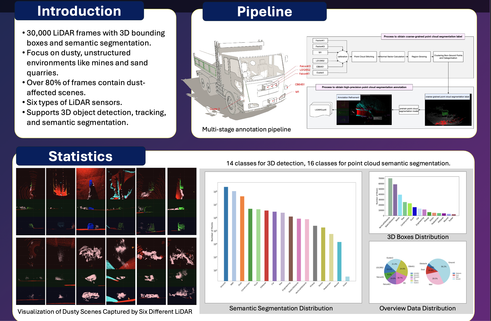

# LiDARDustX Dataset

Thank you for your interest in the **LiDARDustX Dataset**! This dataset is specifically designed for autonomous driving perception tasks in dusty, unstructured road environments, such as mines and sand quarries. It contains 30,000 LiDAR frames with 3D bounding box annotations and point cloud segmentation labels.




## Download Options

To facilitate access to the dataset, we provide two download options:

- **Google Drive Link**: [Google Drive](https://drive.google.com/file/d/1BSfYe4uLqaeKZzg5SzKNpu34UAzx3Dqn/view?usp=drive_link)
- **Hugging Face Link**: [Hugging Face](https://huggingface.co/datasets/Weichenfeng/LiDARDustX)


## Dataset Structure

Upon downloading, you will find the following file and folder structure:

```
LiDARDustX/
    ├── ls128
    │   ├── sequence_xxx.bin
    │   ├── sequence_xxx.label
    │   ├── sequence_xxx.txt
    │   ├── ...
    ├── ls64
    ├── ly150
    ├── ly300
    ├── m1
    └── ouster
```

### Sensor Configuration

The LiDARDustX dataset integrates multiple LiDAR sensors, including solid-state, hybrid solid-state, and mechanical LiDAR types, with the sensors positioned as follows:

- **Front-mounted sensors**: FalconK3, LS128S2, FalconK1, M1
- **Side-mounted sensors**: Ouster2, CB64S1

### File Types

Each LiDAR data sequence is stored in a separate folder, with each frame containing the following three types of files:

| File Type | Description |
|-----------|-------------|
| `.bin`    | Stores raw point cloud data (XYZ + intensity). |
| `.txt`    | Contains 3D bounding box annotations in the format: `class height width length x y z angle`. |
| `.label`  | Stores per-point segmentation labels, with each point in `.bin` having a corresponding integer label. |

### Semantic Segmentation Label Definition

The `.label` file provides per-point semantic segmentation, with each point assigned a category ID as follows:

| Class     | Label ID | Description                          |
|-----------|----------|--------------------------------------|
| Ground    | 0        | Ground                               |
| Dust      | 1        | Dust particles                       |
| Obstacle  | 2        | Obstacles (e.g., vehicles, pedestrians) |
| Wall      | 3        | Structures (e.g., walls, barriers)   |

### Parsing `.label` Files in Python

The following Python script reads the `.label` file and loads the segmentation labels into a NumPy array for further processing:

```python
import numpy as np

def load_label(label_file):
    """
    Load segmentation labels from a .label file.

    Parameters:
        label_file (str): Path to the .label file.

    Returns:
        np.ndarray: Array of labels (uint8), where each value corresponds to a LiDAR point.
    """
    labels = np.fromfile(str(label_file), dtype=np.uint8).reshape(-1, 1)
    return labels

# Example usage
label_file = "example.label"  # Replace with the actual file path
labels = load_label(label_file)
```

## Important Notes

**License Agreement**: The LiDARDustX Dataset is released under an open-source license for non-commercial research and development purposes. Please adhere to the terms of the license when using the dataset.

For more details and benchmark results, please refer to the related paper:

- **Paper**: Chenfeng Wei, Qi Wu, Si Zuo, et al. "LiDARDustX: A LiDAR Dataset for Dusty Unstructured Road Environments." *ICRA 2025*.
- [LiDARDustX](https://arxiv.org/abs/2505.21914)

We hope the **LiDARDustX Dataset** will be a valuable resource for your research and development efforts.
